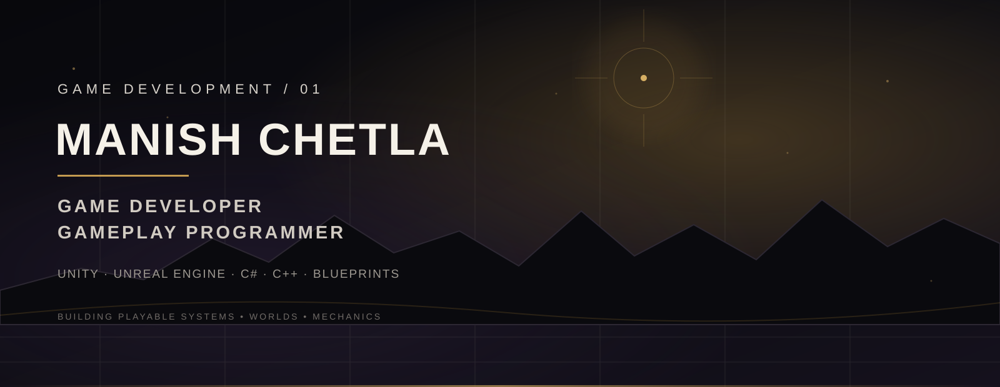
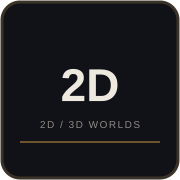
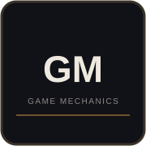
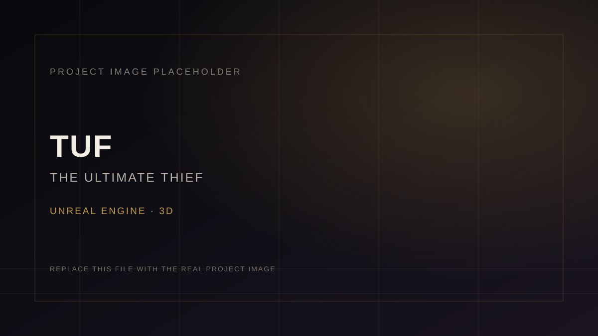
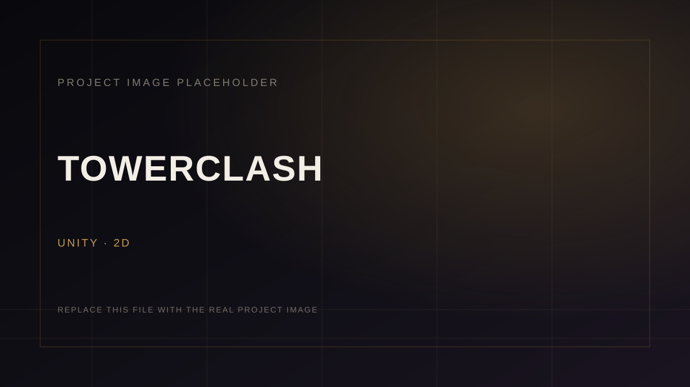
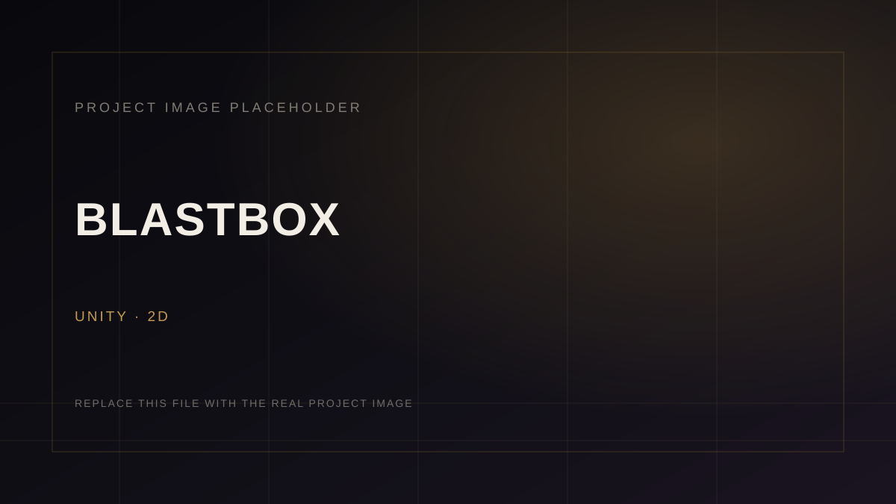
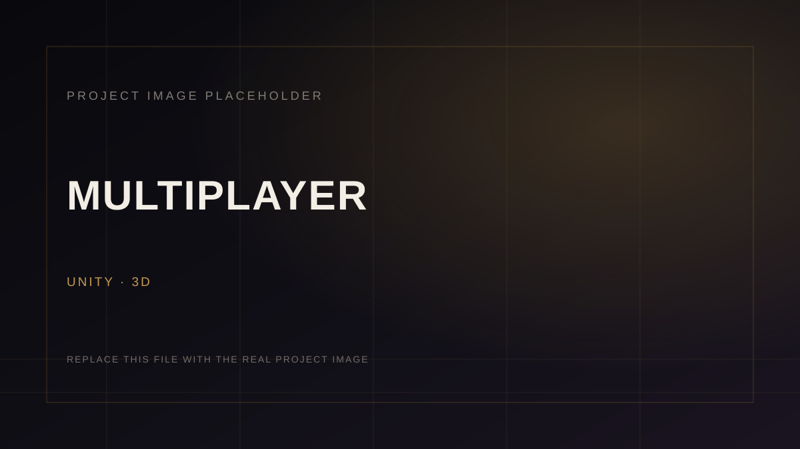
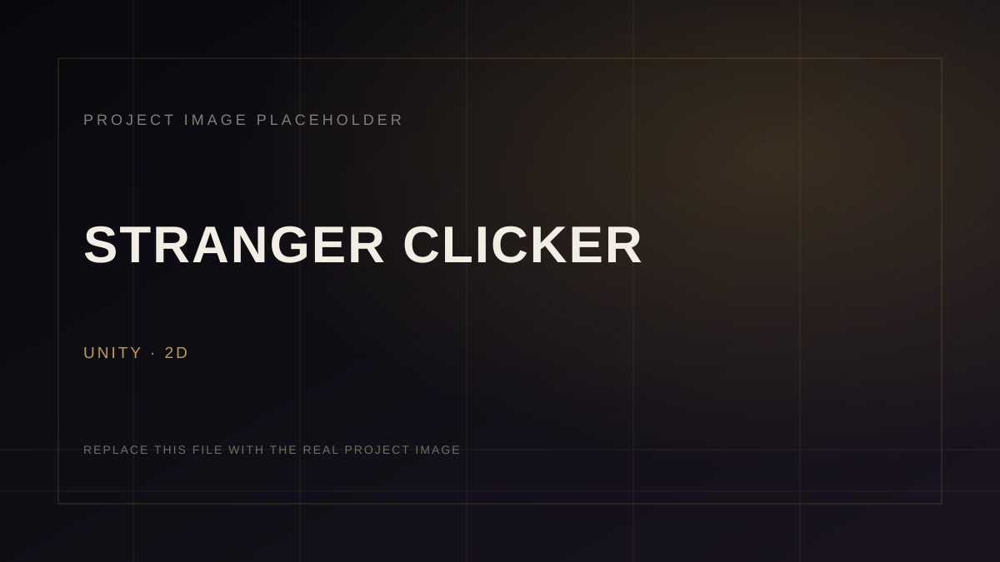
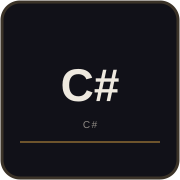
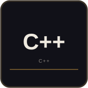

<div align="center">

<a href="https://github.com/ManishChetla">
  
</a>

</div>

<br>

<div align="center">

**GAME DEVELOPER** &nbsp;·&nbsp; **GAMEPLAY PROGRAMMER**

`UNITY` &nbsp; `UNREAL ENGINE` &nbsp; `C#` &nbsp; `C++` &nbsp; `BLUEPRINTS`

</div>

---

## ABOUT THE DEVELOPER

I’m a **Game Developer** focused on gameplay programming and interactive experiences.

I build games and interactive worlds using **Unity** and **Unreal Engine**, with a focus on gameplay systems, mechanics, AI, 2D/3D development, and level design.

I enjoy turning ideas into playable experiences and improving my skills through hands-on game development.

---

## WHAT I BUILD

<table>
<tr>
<td width="25%" valign="top">

###  &nbsp; GAMEPLAY SYSTEMS

<br>

Player interaction, reusable gameplay logic, game-state flow, and systems that make an experience feel responsive.

</td>
<td width="25%" valign="top">

###  &nbsp; AI & PATHFINDING

<br>

AI concepts, navigation, pathfinding, and interactive behaviours for game worlds.

</td>
<td width="25%" valign="top">

###  &nbsp; 2D / 3D WORLDS

<br>

Building playable spaces, environments, levels, and interactive scenes across 2D and 3D projects.

</td>
<td width="25%" valign="top">

###  &nbsp; INTERACTIVE MECHANICS

<br>

Designing and implementing mechanics that turn ideas into something players can actually experience.

</td>
</tr>
</table>

---

# SELECTED WORK

> **Projects first. Statistics second.**  
> The six projects below are the core of this profile.

### 01 — TUF / THE ULTIMATE THIEF



**UNREAL ENGINE · 3D**

The Ultimate Thief is an Unreal Engine 3D project.

`UNREAL ENGINE` `3D`

[**VIEW PROJECT →**](https://github.com/ManishChetla)

---

### 02 — HORROR FPS


**UNITY · 3D**

A Unity 3D Horror FPS project.

`UNITY` `3D`

[**VIEW PROJECT →**](https://github.com/ManishChetla)

---

### 03 — TOWERCLASH



**UNITY · 2D**

A Unity 2D game project.

`UNITY` `2D`

[**VIEW PROJECT →**](https://github.com/ManishChetla)

---

### 04 — BLASTBOX



**UNITY · 2D**

A Unity 2D game project.

`UNITY` `2D`

[**VIEW PROJECT →**](https://github.com/ManishChetla)

---

### 05 — MULTIPLAYER



**UNITY · 3D**

A Unity 3D multiplayer project.

`UNITY` `3D` `MULTIPLAYER`

[**VIEW PROJECT →**](https://github.com/ManishChetla)

---

### 06 — STRANGER CLICKER



**UNITY · 2D**

A Unity 2D game project.

`UNITY` `2D`

[**VIEW PROJECT →**](https://github.com/ManishChetla)

---

## TECHNOLOGY

### GAME ENGINES

 &nbsp;


### PROGRAMMING

 &nbsp;
 &nbsp;


### 3D / TOOLS

 &nbsp;


**GAME DEVELOPMENT FIRST.**

---

## CURRENTLY BUILDING

```text
GAMEPLAY PROGRAMMING     ──────  gameplay logic, systems, interaction
GAME SYSTEMS             ──────  reusable mechanics and game flow
AI & PATHFINDING         ──────  navigation and behaviour
3D DEVELOPMENT           ──────  interactive worlds and spaces
UNITY + UNREAL ENGINE    ──────  hands-on engine development
```

No artificial skill percentages. The work is the evidence.

---

# GITHUB ACTIVITY

GitHub activity is included as supporting evidence — not as the main portfolio.

<div align="center">


</div>

---

## GITHUB TROPHIES

<div align="center">


</div>

---

## TOP CONTRIBUTED REPOSITORIES

<div align="center">


</div>

---

# LET'S CONNECT

<div align="center">

<a href="https://github.com/ManishChetla">
  
</a>
&nbsp;&nbsp;
<a href="https://www.linkedin.com/in/manish-chetla/">
  
</a>

<br><br>

**PORTFOLIO** &nbsp;·&nbsp; **LINKEDIN** &nbsp;·&nbsp; **ITCH.IO** &nbsp;·&nbsp; **GITHUB**

</div>

---

<div align="center">

### BUILDING GAMES. &nbsp; LEARNING SYSTEMS. &nbsp; CREATING WORLDS.

<sub>GAME DEVELOPMENT / GAMEPLAY PROGRAMMING / INTERACTIVE EXPERIENCES</sub>

</div>
